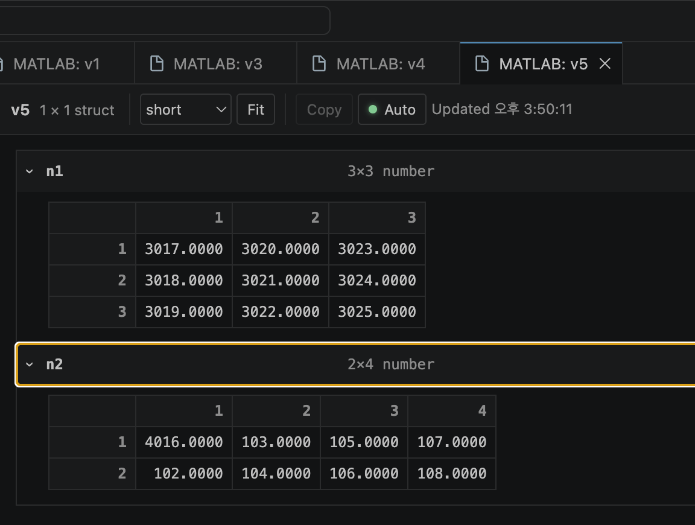
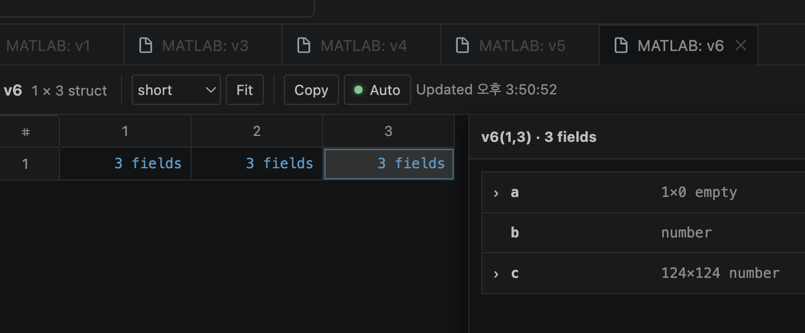

<div align="center">
  
  <h1>MATLAB Variable Viewer for VS Code</h1>
  <p>Inspect matrices, structures, cells, tables, and N-D arrays without leaving VS Code.</p>
  <p>
    <a href="https://github.com/Gureum-Yeoreum-Tori/matlab-variable-viewer-vscode/actions/workflows/ci.yml"></a>
    
    
    
  </p>
</div>

> [!IMPORTANT]
> This is an independent, unofficial fork of the
> [MathWorks MATLAB extension for VS Code](https://github.com/mathworks/MATLAB-extension-for-vscode).
> It is not published, supported, or endorsed by MathWorks. Disable the official
> `MathWorks.language-matlab` extension before enabling this fork because both
> extensions contribute the same MATLAB commands, language, terminal, and views.

## Why this fork exists

The official Workspace view is useful for variable names, classes, and compact
previews, but it does not provide a MATLAB-style detailed value inspector. This
fork adds one directly to the existing Workspace: double-click a variable and
inspect it in a normal VS Code editor tab.

The existing MathWorks editing, execution, debugging, project, terminal, and
language-server features remain available.

## What it can inspect

| Data | Viewer behavior |
| --- | --- |
| Large numeric and logical matrices | Virtualized grid, buffered paging, boundary prefetch, selection copy |
| Cells and scalar structures | Expandable nested fields with preserved open state |
| Structure arrays | Select an element, then inspect and expand its fields |
| Tables and timetables | Variable names, row names, and row times |
| Higher-dimensional arrays | Explicit dimension controls, slice strip, and hidden-slice change markers |
| Changing workspace values | Automatic refresh with changed cell, descendant, and slice highlighting |

Formatting controls include `short`, `long`, scientific formats, column fitting,
and bounded TSV copying.

## Screenshots

### Expanded structure fields

Nested matrices remain rectangular instead of being split into individual tree
elements. Expanded fields stay open across automatic refreshes.



### Structure-array inspector

Select a structure-array element to inspect its fields without flattening the
entire array.



## Requirements

- Visual Studio Code
- MATLAB R2021b or later for advanced MATLAB features
- MATLAB R2023a or later for the Workspace and detailed Variable Viewer

The viewer uses the MATLAB connection already managed by the extension. It does
not scrape MATLAB process memory.

## Install

Download the VSIX and matching SHA-256 file from this repository's GitHub
Releases page, then run **Extensions: Install from VSIX...** in VS Code.

Until a tagged release exists, build from source:

```sh
git clone --recurse-submodules https://github.com/Gureum-Yeoreum-Tori/matlab-variable-viewer-vscode.git
cd matlab-variable-viewer-vscode
npm run project-install-clean
npm run package:check
npm run package
```

`npm run package` prunes language-server development dependencies. Run
`npm run project-install-clean` before continuing server development afterward.

## Try the demo workspace

Run [`examples/variable_editor_demo.m`](examples/variable_editor_demo.m), open the
MATLAB Workspace view, and double-click `v1` through `v12`. The demo covers large
matrices, cells, nested structures, tables, timetables, and N-D arrays.

A minimal example:

```matlab
A = reshape(1:36, 6, 6);
S = struct('matrix', magic(5), 'nested', struct('values', rand(3)));
C = {A, S, table((1:4)', rand(4,1), 'VariableNames', {'ID','Score'})};
N = reshape(1:(4*5*3), 4, 5, 3);
```

## How data moves

1. A Workspace double-click opens a VS Code Webview editor.
2. The extension validates the variable and nested-field expression.
3. MATLAB returns a bounded page or structured response through the existing
   local connection.
4. The Webview renders only the visible matrix region and prefetch buffer.
5. Workspace change notifications coalesce into one refresh per visible editor.

See [Variable Editor Architecture](VARIABLE_EDITOR_ARCHITECTURE.md) for paging,
formatting, change detection, and protocol details.

## Privacy and security

- Variable values stay between the local MATLAB process, VS Code extension host,
  and Variable Viewer Webview.
- Variable values are not logged or written to disk by the viewer.
- Copying writes to the system clipboard only after a user action.
- Inherited MathWorks telemetry transmission is disabled; the compatibility
  telemetry service is a local no-op.
- Webview messages, MATLAB expressions, page sizes, structured depth, response
  size, and clipboard output are validated or bounded.
- The licensing helper binds to loopback and protects its local bearer URL with
  user-only storage permissions.

Read [Security Review](SECURITY_REVIEW.md) and report vulnerabilities privately
according to [SECURITY.md](SECURITY.md).

## Bugs and feature requests

Issues are welcome, especially when they include minimal MATLAB code, the
variable class and size, operating system, VS Code version, and MATLAB release.
Please remove proprietary values, credentials, license tokens, and private paths.

Support is **best effort** and there is no response-time or fix-time guarantee.
An accepted issue may remain in the backlog until a contributor has time to work
on it. Pull requests are welcome; see [CONTRIBUTING.md](CONTRIBUTING.md).

## Project origin and AI disclosure

This repository preserves the upstream MathWorks MIT license and copyright
notices. All fork-specific implementation, tests, documentation, icons,
workflows, and security hardening for version 1.4.0 were generated with
**OpenAI Codex** under the maintainer's direction and review. Upstream MathWorks
code was not generated by Codex.

See [AI_DISCLOSURE.md](AI_DISCLOSURE.md) for the full attribution and
responsibility statement.

MATLAB is a registered trademark of The MathWorks, Inc. The name is used only to
describe compatibility. This project is not affiliated with or endorsed by
MathWorks.

## Development

Use Node.js 22 and clone recursively:

```sh
npm run project-install-clean
npm audit
npm audit --prefix server
npm audit --prefix server/src/licensing/gui
npm run compile
npm run lint
npm run test-wsb:fast
npm test --prefix server
npm run package:check
```

The current automated suite contains 178 Workspace/Variable Editor tests and 240
language-server tests. The release process and remaining manual MATLAB checks are
documented in [RELEASING.md](RELEASING.md).

## License

MIT. See [LICENSE](LICENSE).
