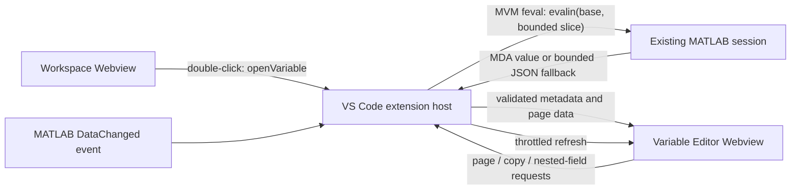

# Variable Editor Architecture

This document describes the Variable Editor added to this fork of the MathWorks MATLAB extension for Visual Studio Code. It covers the implementation in version 1.4.0 of this fork.

## Purpose and trust boundary

The Variable Editor does not attach to MATLAB process memory and does not parse MATLAB's private in-memory representation. It reuses the MATLAB Virtual Machine (MVM) connection already owned by the official extension and requests data through MATLAB expressions evaluated in the base workspace.

This keeps MATLAB startup, licensing, code execution, and workspace notifications in the upstream extension. The fork adds a detailed viewer on top of that connection.



No additional MATLAB process is started for the Variable Editor, and the feature does not add a network service of its own.

## Open and restore lifecycle

1. `src/workspacebrowser/webview.ts` listens for a double-click on a workspace row and posts the row's variable name as `openVariable`.
2. `WorkspaceBrowserProvider.openVariableEditor` accepts only a root variable or dot-separated field path matching `^[A-Za-z]\w*(?:\.[A-Za-z]\w*)*$`.
3. A scripted `WebviewPanel` is created in the same editor group as the most recently active Variable Editor panel.
4. The Webview posts `ready` after creation or restoration. The extension then loads the last retained page, so moving or joining tabs does not leave the panel permanently in a loading state.
5. Disposing a panel removes its automatic-refresh callback and panel tracking state.

The Webview has no local resource roots. A random nonce permits its one inline
script and stylesheet under a `default-src 'none'` Content Security Policy.
Messages crossing back into the extension host are runtime-validated rather
than trusted from their TypeScript shape.

`retainContextWhenHidden` preserves scroll and UI state while a panel is hidden. VS Code Webview state persists number format, precision, column width, and the automatic-refresh setting.

## Data request pipeline

Every load has two logical phases:

1. Metadata: MATLAB evaluates a structure containing `name`, `class`, and `size`.
2. Page values: MATLAB evaluates a bounded slice of the variable.

The grid loads an overlapping 160-row by 60-column window and advances it in 80-row by 30-column strides. When the visible area approaches a loaded boundary, the Webview requests the next overlapping window in the background. A scrollbar jump requests the window containing the new viewport directly instead of walking through every intermediate page. Existing cells remain rendered while MATLAB loads the next window, so normal scrolling does not show a blocking loading overlay. Dimensions 3 and above are represented by one-based page selectors.

Numeric and logical slices use the MVM's native MathWorks Data Array (MDA) representation directly. This avoids a MATLAB `jsonencode` pass and a JavaScript `JSON.parse` pass for large matrices. Complex values use a bounded JSON fallback:

```matlab
evalin('base', 'jsonencode(<validated expression>)')
```

`parseMda` converts the MVM representation from column-major MATLAB storage into row-major JavaScript values. Tables and timetables are sliced first, then serialized as row records together with `Properties.VariableNames`. The row header uses `Properties.RowNames` when available, numeric row indices otherwise, and `Properties.RowTimes` for timetables. This preserves mixed-type columns without flattening the table into one column.

Each Webview panel owns a monotonically increasing request ID and a single-flight queue. A new request invalidates the running result and replaces the one pending request. MATLAB evaluation is not currently cancellable, but rapid scroll/refresh activity cannot grow an unbounded set of concurrent page evaluations.

JSON responses are capped at 4 MB before they leave MATLAB, then structured
values are bounded to eight levels and 50,000 nodes before posting to the
Webview. Numeric/logical MDA pages remain bounded by the 160 by 60 page. The
top-level class allowlist rejects custom classes and unsupported object types.

## Rendering modes

- Numeric, logical, text, cell, structure arrays, tables, and timetables use the virtualized grid.
- Scalar structures use the expandable inspector. Expanded field paths survive automatic refreshes, and a collapsed compound field reports how many descendant values changed.
- A matrix inside a scalar structure is rendered as a two-dimensional nested table, rather than as separately expanded row arrays.
- A compound grid cell can be double-clicked to open a side drawer.
- A nested dot-addressable field can be opened in another Variable Editor tab.
- Dimensions 3 and above are selected from the toolbar or from a combined slice strip. For bounded numeric/logical arrays, MATLAB computes compact per-slice fingerprints so the strip can mark a changed slice even while another slice is visible. The fingerprint scan is limited to 256 slices and 2,000,000 total elements; larger arrays retain navigation without background change markers.

Only the visible viewport plus a small overscan margin is placed in the grid DOM. The spacer represents the full variable size, while the larger in-memory overlap keeps upcoming values available during normal scrolling. For a 160 by 60 loaded window this reduces live cell elements from 9,600 to a few hundred on a typical editor viewport.

## Selection and clipboard

The Webview tracks a rectangular one-based selection and posts its bounds to the extension host. The extension revalidates the selection against current metadata, refuses selections larger than 10,000 cells, refetches the selected slice, converts it to TSV, and writes it with `vscode.env.clipboard`.

Copying is user-initiated and limited to 10,000 cells and 4 MB of UTF-8 TSV.
Variable values are not written to disk by this feature.

## Automatic refresh

The upstream workspace service emits `DataChanged` when MATLAB reports a workspace mutation. The provider coalesces rapid notifications using the existing 300 ms workspace throttle, then asks each open Variable Editor to refresh its metadata and current page. Structure inspectors and compound-cell drawers retain their expanded paths during this replacement. A panel can pause this behavior with the **Auto** button.

Visible panels refresh for workspace mutations. Hidden panels are marked dirty
and refresh once they become visible. The upstream event does not yet identify
which individual variable changed. See `SECURITY_REVIEW.md` for the remaining
resource-usage considerations.

## Main implementation files

- `src/workspacebrowser/webview.ts`: workspace row double-click event.
- `src/workspacebrowser/types.ts`: `openVariable` message type.
- `src/workspacebrowser/WorkspaceBrowserProvider.ts`: panel lifecycle, MVM evaluation, paging, copying, and automatic refresh.
- `src/workspacebrowser/variableEditor.ts`: Variable Editor HTML/CSS/JavaScript and pure TSV helper.
- `src/test/workspacebrowser/variableEditor.test.ts`: helper and JSDOM interaction tests.

## Build and verification

Use a clean checkout and the repository's pinned lockfiles:

```sh
npm ci
npm run compile
npm run lint
npm run test-wsb:fast
```

Before packaging, compile and prune the server exactly as the upstream release workflow expects. Do not depend on a previously generated `server/out` directory.

Manual MATLAB verification should cover:

- a small matrix and a matrix larger than one page;
- scalar and non-scalar structures;
- cells, tables, and timetables;
- arrays with at least four dimensions;
- automatic refresh after rerunning a MATLAB section;
- restored panels after moving a tab to another window or editor group;
- copying a bounded selection.
